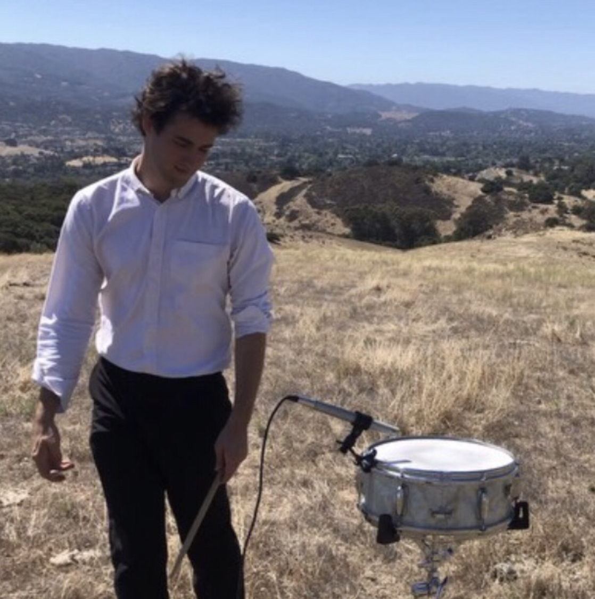

# Live Music for the NeurIPS 2019 Banquet
This page contains information about the live music at the NeurIPS 2019 banquet.

## Performers

### Josh Payne

Josh Payne is an undergraduate at Stanford University studying Mathematical and
Computational Science. He's released two albums with his jazz quintet, The Four
O'Clock Five, and has an artist sponsorship with Soultone Cymbals. He's
performed with Darlene Love, Sō Percussion, Joshua Redman, Kenny Washington,
Ingrid Jensen, Jeff Clayton, Jimmy Heath, Jim Pugh, and others.
