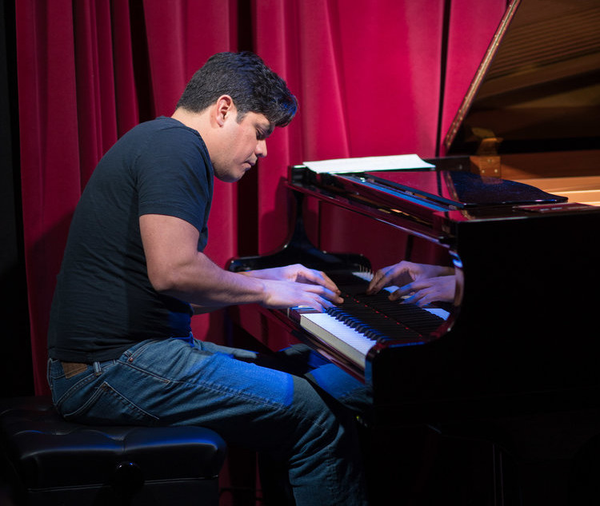
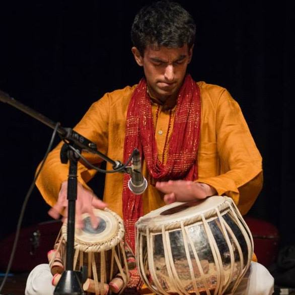
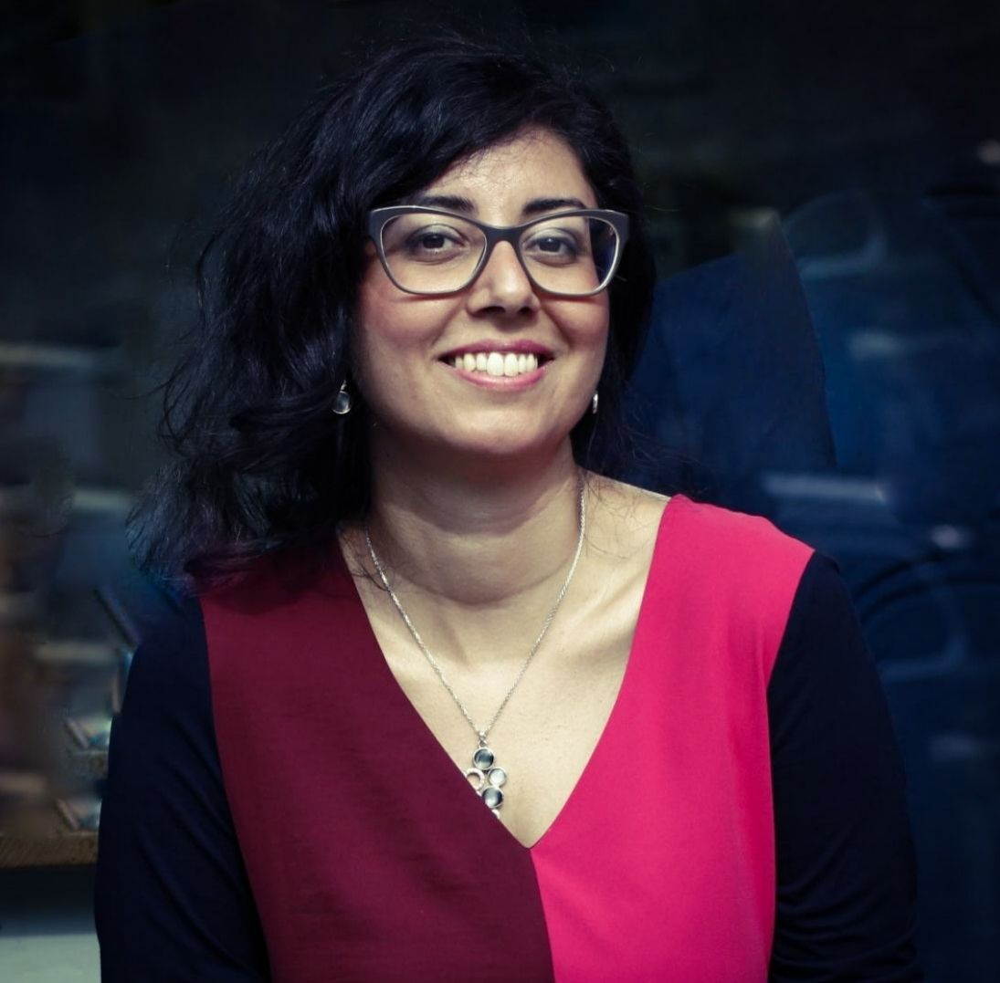
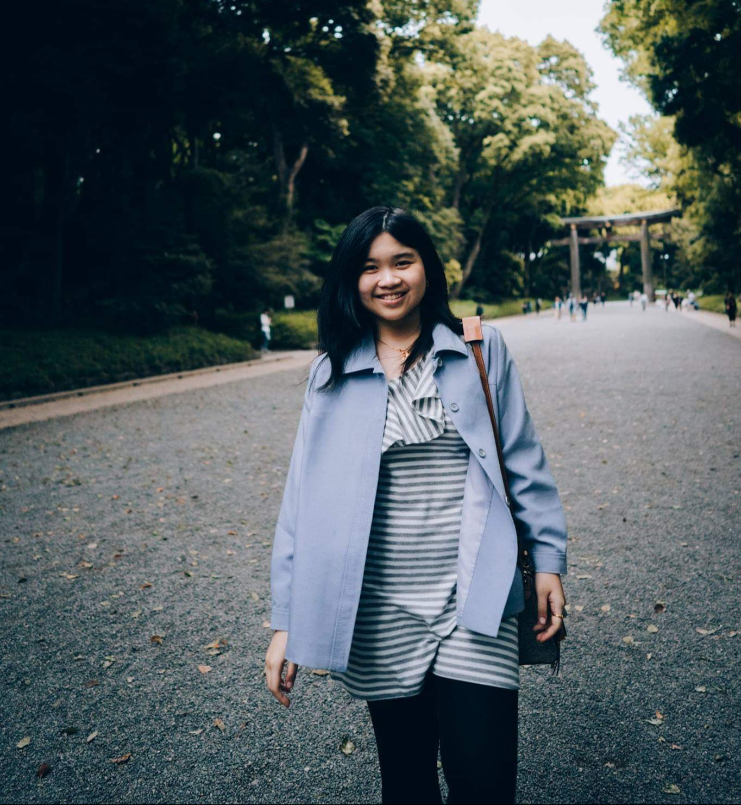
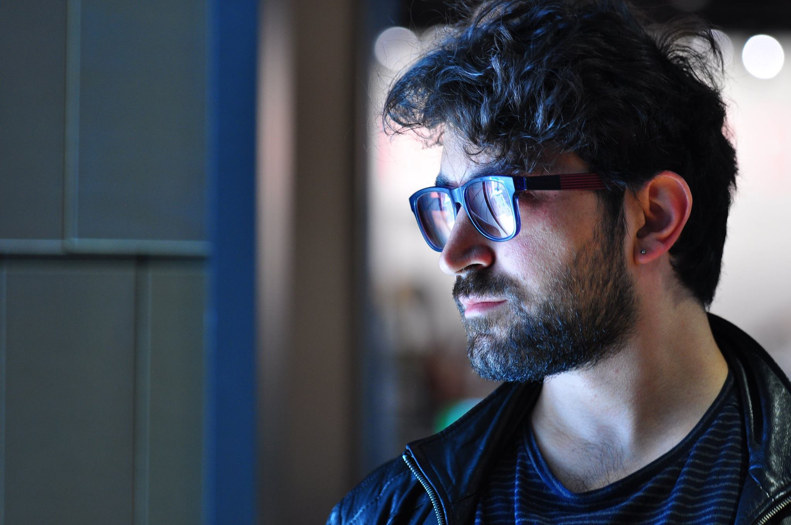
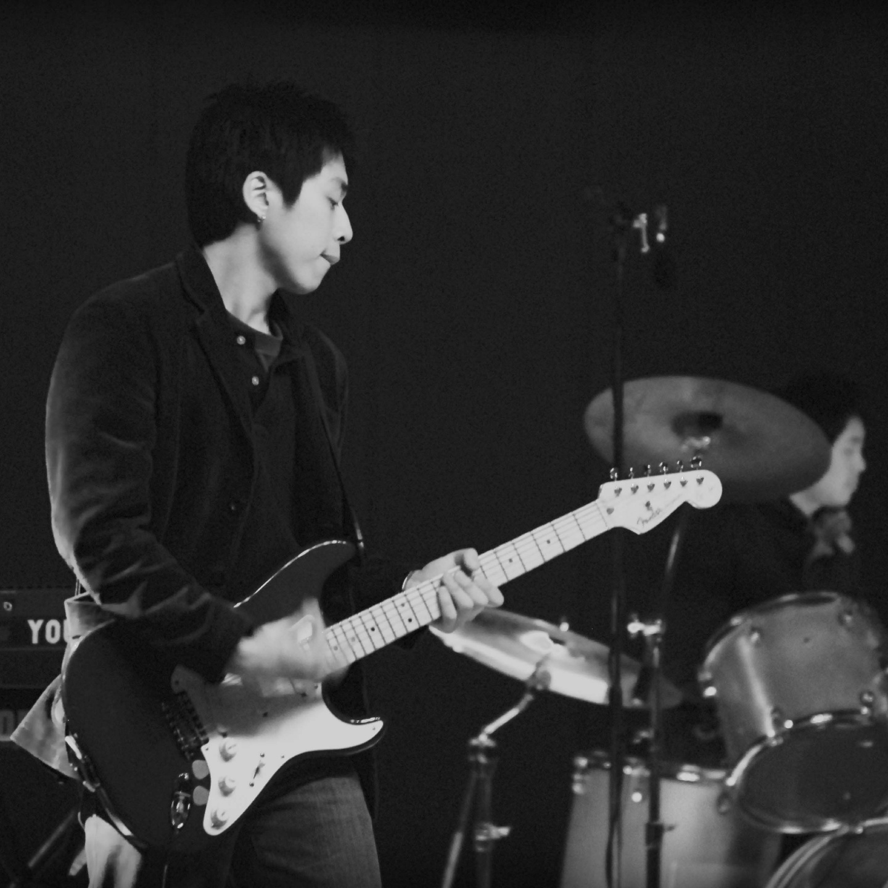
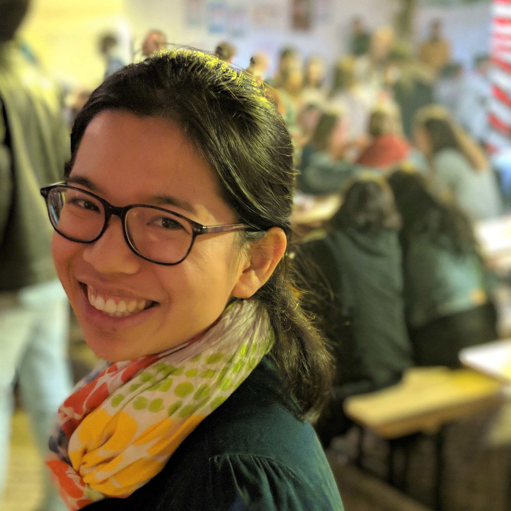
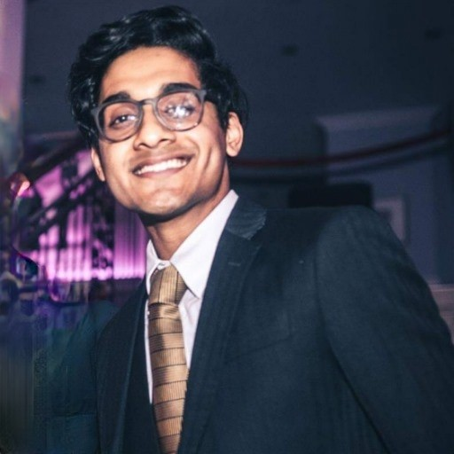
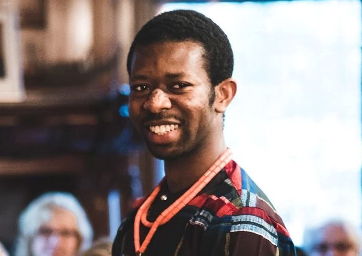

# Live Music for the NeurIPS 2019 Banquet
This page contains information about the live music at the NeurIPS 2019 banquet.

## Performers

### Pablo Samuel Castro (Piano / Guitar)

Pablo Samuel Castro is the NeurIPS'19 Party Chair, and is happy to also be one of its performers! He has been playing music all his life, focusing mostly on piano and guitar. He has released 3 full length albums with Jai Guru (rock/funk), Ecos de Portoalegre (latin jazz), and [psc trio](https://www.psctrio.com/) (his current jazz trio, which you can listen to on any streaming service). In addition to playing music, he's a staff research software developer at Google Brain in Montreal. See what he's up to on [Twitter](https://twitter.com/pcastr).
      

---

### Good Kid (Full band)

Good kid is band of five programmers that met at the university of Toronto while studying computer science. They have played their brand of fast paced indie rock in New York, LA, and Toronto and are super excited to play NeuRIPS! During the daytime Nick Frosst (vocals) works at Google Brain where he focuses on adversarial examples and capsule networks. He has been trying to convince the other members to abandon their respective fields to get in on the deep learning hype, but so far he has only convinced Jon (drums).

---

### Saurabh Kumar (Tabla)

Saurabh Kumar plays the tabla, an Indian classical percussion instrument, and has been learning the tabla for the past 18 years. In his free time, he is a PhD student at Stanford and was a past AI Resident at Google Brain.
      

---

### Josh Payne (Drums)

Josh Payne is an undergraduate at Stanford University studying Mathematical and Computational Science. He's released two albums with his jazz quintet, The Four O'Clock Five, and has an artist sponsorship with Soultone Cymbals. He's performed with Darlene Love, Sō Percussion, Joshua Redman, Kenny Washington, Ingrid Jensen, Jeff Clayton, Jimmy Heath, Jim Pugh, and others.
    

---

### Tina Raissi (Piano)

Tina Raissi is finishing her Master’s studies in Computer Science and working in the field of automatic speech recognition at RWTH Aachen University. In a past life, she was a professional classical pianist, performing as a soloist and chamber musician in important Italian theaters. Currently, she is exploring the open seas of context-dependent acoustic modelling for speech recognition.
         

---

### Nixie Sapphira Lesmana (Voice)

Nixie S. Lesmana is a first-year PhD student at Nanyang Technological University, Singapore. Her primary research interest is to advance understanding of technological innovation surrounding financial markets, with a current focus on RL applications to optimal control problems in finance. Nixie earned her Bachelor’s degree in Mathematical Sciences with Minor in Finance from NTU in 2017. More info can be found on her [LinkedIn](https://www.linkedin.com/in/nixie-sapphira-lesmana-6619abb0/). Putting research/maths aside, she loves and has been singing for more than half her life (for some videos of her singing history, visit [this link](https://www.youtube.com/results?search_query=nixie+sapphira+lesmana)).
   

---

### Umut Şimşekli (Bass)

Umut Şimşekli received his PhD degree in 2015 from Bogaziçi University, İstanbul, Turkey. His current research interests are in large-scale Bayesian machine learning, diffusion-based Markov Chain Monte Carlo, non-convex optimization, and audio/music processing. He is an assistant professor within the Signals, Statistics, and Machine Learning Group at Telecom ParisTech in Paris and currently a visiting researcher at the University of Oxford, Department of Statistics. He used to work as a professional bass guitar player for several years in Istanbul. Previously, he was a member of the Turkish pop/jazz band [Six Pack](https://www.youtube.com/user/6packlive).

---

### Yale Song (Guitar)

Yale Song has been playing guitar for more than 20 years in different genres ranging from classic rock and blues to funk and pop music. Prior to moving to the US, he was part of a Korean indie rock band Line Shaped Circle and was performing regularly in rock clubs in Hongdae area, known for its urban arts and indie music culture. Apart from his life as a musician, he is a researcher working on computer vision and machine learning, especially on learning representations of visual data from unlabeled images and videos. He received his Ph.D. from MIT and now is a senior researcher at MSR Redmond. To learn more about his music and scholarly work, check his [YouTube channel](http://youtube.com/yalesong) and [personal website](http://people.csail.mit.edu/yalesong/).
   

---

### Mélisande Teng (Vocals)

Mélisande Teng is currently working in the [Climate Change AI team](https://mila.quebec/en/ai-society/visualizing-climate-change/) at Mila, and is interested in computer vision and the applications of AI  for social good.  She  graduated from Ecole Centrale Paris in applied mathematics and   ESSEC Business School in management & social entrepreneurship, and obtained a Master's degree in computer vision and machine learning (MVA) from ENS Paris Saclay. She usually plays the piano, but is very excited (and a little terrified!) to be singing at NeurIPS. She enjoys writing [songs](https://soundcloud.com/thisismelisande) and you can find her on  [LinkedIn](https://www.linkedin.com/in/melisandeteng/).

   

---

### Dhruv Karthik (Vocals)

Dhruv Karthik is an Undergraduate Junior + Masters Student at the University of Pennsylvania, studying Computer Science and Robotics. His current research interests are on using end-to-end learning to teach [small autonomous racecars](f1tenth.org) how to race, and learn safe policies in simulation that transfer to reality. He regularly plays acoustic performances all around campus, and the Philadelphia area. Check out his music on [instagram](https://www.instagram.com/dhruv_karthik/), and find him on [linkedin](https://www.linkedin.com/in/dhruvkarthik/).
   

--- 

### Charles Onu (Vocals)

[Charles](https://onucharles.wordpress.com/about/) will be performing at NeurIPS for the second year in a row. He sings, plays the piano and the acoustic guitar. Neither of the 3 was learnt professionally but he might have learnt how to fake it. You'll find some of his performances on [his facebook page](https://www.facebook.com/onucharlesc/videos/). Recently he has been learning to play the harmonica, but the tiny instrument seems to be sucking all the breath out of him. When the stars align, he usually studies as a PhD student at McGill University and Mila in Montreal. He founded [Ubenwa](http://ubenwa.ai) to leverage machine learning for low-cost medical diagnosis.

   

--- 
